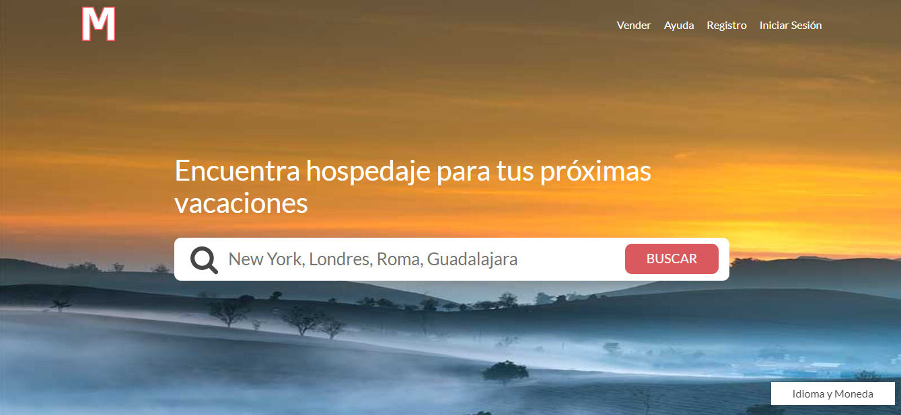

#	Curso CSS Grid y Flexbox

##	**PROYECTOS**

###	Proyecto 1 - Cards con Flexbox

    

###	Proyecto 2 - Menús de Navegación con Flexbox

    

###	Proyecto 3 - Cursos en linea

    

###	Proyecto 4 - Login-Netflix - SASS,Gulp y Flexbox

    

###	Proyecto 5 - Diseño de un Blog

    

###	Proyecto 6 - Holy Grail Layout

    

###	Proyecto 7 - Panel de Administración

    

###	Proyecto 8 - Blog de Recetas

    

###	Proyecto 9 - Sitio Web de Bienes Raices

    

###	Proyecto 10 - Sitio Web para un Freelancer

    

###	Proyecto 11 - Sitio AirBNB

    

